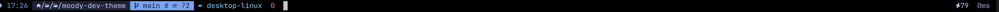

# **Moody Dev — Oh My Posh Theme**

Un thème sombre, élégant et lisible pour **Oh My Posh**, conçu pour un usage quotidien en développement.  
Il affiche l’heure, le chemin, la branche Git, les runtimes (Node/Python/Docker/Kubernetes/AWS), le temps d’exécution et le statut de la commande — le tout dans une direction artistique *dark & moody*.

---

## **Preview**



---

## **Fichiers**

- Thème : `~/.poshthemes/moody-dev.omp.json`  
- Documentation : `README.md`

---

## **Installation**

### **1. Installer Oh My Posh**

```bash
brew install oh-my-posh
````

### **2. Installer une Nerd Font (icônes)**

```bash
brew tap homebrew/cask-fonts
brew install --cask font-jetbrains-mono-nerd-font

# Optionnel : compatibilité maximale des glyphes
brew install --cask font-nerd-font-symbols-only
```

### **3. Activer la police dans ton terminal**

* **iTerm2** : Profiles → Text → Font → *JetBrainsMono Nerd Font*
* **Terminal macOS** : Preferences → Profiles → Text → Change… → *JetBrainsMono Nerd Font*

➡️ **Redémarre ton terminal après changement.**

### **4. Installer le thème**

```bash
mkdir -p ~/.poshthemes
# Copie ici ton fichier moody-dev.omp.json
```

### **5. Activer dans le shell**

#### **Zsh (par défaut sur macOS)**

```bash
echo 'eval "$(oh-my-posh init zsh --config ~/.poshthemes/moody-dev.omp.json)"' >> ~/.zshrc
source ~/.zshrc
```

#### **Bash**

```bash
echo 'eval "$(oh-my-posh init bash --config ~/.poshthemes/moody-dev.omp.json)"' >> ~/.bash_profile
source ~/.bash_profile
```

---

## **Segments inclus**

* **Time** — heure au format 24h (modifiable)
* **Path** — chemin stylisé powerline
* **Git** — branche + statut (ajouts, modifications, suppressions, stash, upstream)
* **Node** — version détectée selon projet
* **Python** — venv/conda (si actif)
* **Docker** — contexte (si actif)
* **Kubernetes** — contexte + namespace
* **AWS** — profil + région actifs
* **Execution time** — durée de la dernière commande
* **Status** — code retour
* **Battery** — affichage à droite (Zsh uniquement)

---

## **Palette de couleurs**

| Élément | Couleur   |
| ------- | --------- |
| Bleu    | `#7aa2f7` |
| Cyan    | `#7dcfff` |
| Magenta | `#bb9af7` |
| Vert    | `#9ece6a` |
| Orange  | `#e0af68` |
| Rouge   | `#f7768e` |
| Fond    | `#1a1b26` |
| Texte   | `#c0caf5` |

---

## **Personnalisation rapide**

### **Afficher le temps d’exécution uniquement au-delà d’un certain seuil**

Dans `executiontime.properties.threshold` :

```json
"threshold": 200
```

### **Afficher les secondes dans l’heure**

Dans le segment `time` :

```json
"time_format": "15:04:05"
```

### **Améliorer les performances dans de gros dépôts Git**

Dans le segment `git` :

```json
"fetch_status": false
```

### **Support du rprompt**

**Bash : non supporté.**
  Si tu veux afficher `executiontime` en Bash → place-le dans `prompt` au lieu de `rprompt`.

---

## **Dépannage**

### **Icônes carrées ou absentes**

✔ Vérifie que la Nerd Font est bien activée
✔ Redémarre ton terminal

### **Le thème ne s’affiche pas**

✔ Vérifie la ligne d’init dans `~/.zshrc` ou `~/.bash_profile`
✔ Recharge le shell :

```bash
source ~/.zshrc
```

### **Debug du thème**

```bash
oh-my-posh debug --config ~/.poshthemes/moody-dev.omp.json
```

### **Tester sans modifier le shell**

```bash
oh-my-posh print-shell --config ~/.poshthemes/moody-dev.omp.json
```

---

## **Licence**

Ce thème est fourni tel quel.
Libre à toi de le modifier, partager ou publier — pense simplement à ajouter une capture d’écran.
